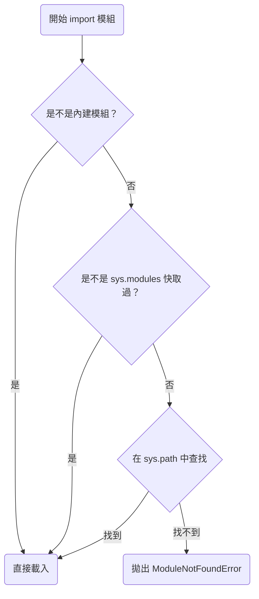

# Python `import` 模組查找順序說明

## 📘 1. 概述

Python 在執行 `import 模組名稱` 時，會依據一定的優先順序進行查找，直到找到為止，否則會拋出 `ModuleNotFoundError`。

---

## 📚 2. 查找優先順序概覽

| 優先順序 | 查找位置                     | 說明                                             |
|----------|------------------------------|--------------------------------------------------|
| 1        | 內建模組（Built-in Modules） | 如 `sys`、`math`，最快直接載入                  |
| 2        | 已載入模組快取 (`sys.modules`) | 重複 import 時直接從記憶體快取載入               |
| 3        | 當前工作目錄（`sys.path[0]`） | 與主程式同目錄或當前 shell 的 cwd                |
| 4        | 其他路徑（來自 `sys.path`）   | 包含虛擬環境、全域套件、環境變數 `PYTHONPATH` 等 |
| 5        | 找不到時                     | 拋出 `ModuleNotFoundError`                       |

---

## 🧪 3. `sys.path` 詳解

Python 使用 `sys.path`（一個 `list` 物件）作為模組查找的主要依據：

```python
import sys
for p in sys.path:
    print(p)
```

### 典型內容（順序）：
1. `sys.path[0]`：執行主程式所在目錄
2. 虛擬環境（venv）下的 `site-packages`
3. Python 安裝路徑下的標準庫目錄
4. 自定環境變數 `PYTHONPATH`
5. 系統自動加載的其他目錄

---

## 🛠️ 4. 圖解：模組查找邏輯



---

## 🧨 5. 常見陷阱與命名問題

### ✅ 正確命名
避免使用與標準模組名稱相同的檔名，例如不要叫：

```
math.py
os.py
sys.py
```

### ❌ 錯誤示範

假設你有一個檔案結構如下：

```
/my_project/
    math.py
    main.py
```

當你在 `main.py` 裡：

```python
import math
```

將導入你自己寫的 `math.py`，而非內建模組！

---

## 🧵 6. 實用補充：如何動態加入模組路徑

### 範例：
```python
import sys
from pathlib import Path

# 加入指定相對路徑（範例：my_modules 目錄）
module_path = Path(__file__).parent / "my_modules"
sys.path.insert(0, str(module_path))
```

### 為什麼用 `insert(0, ...)` 而不是 `append(...)`？
因為你想要優先查這個路徑，避免被系統其他模組覆蓋。

---

## 🧾 7. 總結

| 查找順序 | 類型                             |
|----------|----------------------------------|
| 1        | 內建模組                         |
| 2        | 快取（`sys.modules`）            |
| 3        | 當前目錄（`sys.path[0]`）        |
| 4        | 其他路徑（`sys.path[1:]`）       |
| 5        | 找不到 → `ModuleNotFoundError` |

---

## 📎 附錄：查找路徑觀察工具

```python
import sys

print("Python 模組查找路徑：")
for i, path in enumerate(sys.path):
    print(f"{i+1:02d}. {path}")
```

---
